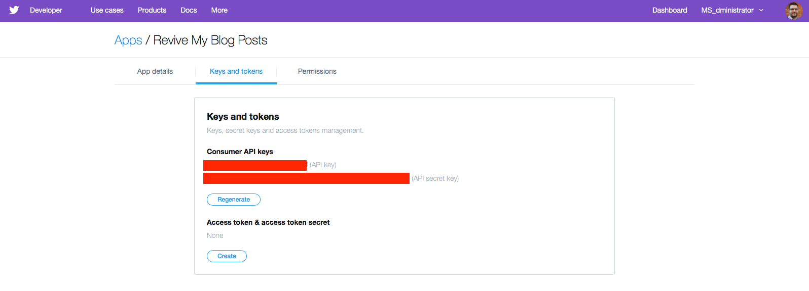

# tweet_phish

tweet-phish is a Python package and CLI tool to tweet about identified phishing websites by providing a URL

### Prerequisites

In order to send a tweet you will need API access. You can set this up by doing the following:

### Twitter

To use this tool you will also need to generate some keys to post to twitter. To do this, you will need to create a Twitter Application.

The first step is to visit https://dev.twitter.com/apps/new and create a new Twitter application. When you create a new Twitter application you will need to provide the required information.


Next, you will need to select the “Keys and Tokens” tab and gather all your keys. Please keep these secure! We will be using them when we get to the AppVeyor section below.




### Installing

Please do the following:

```
git clone https://github.com/MSAdministrator/tweet-phish.git
cd tweet-phish
python3 setup.py install
```

## Using

You can use `tweet-phish` on the command line by providing (or setting) your twitter credentials:

```python
tweet-phish save_config --twitter_consumer_key {SOMEKEY} -- twitter_consumer_secret {SOMEKEY} --twitter_access_token {SOMEKEY} --twitter_access_token_secret {SOMEKEY}
```

Next you can run `tweet-phish` by providing a URL like so:

```python
tweet-phish tweet 'http://somephishingwebsite.com'
```

That's it!

## Built With

* [carcass](https://github.com/MSAdministrator/carcass) - Python packaging template

## Contributing

Please read [CONTRIBUTING.md](CONTRIBUTING.md) for details on our code of conduct, and the process for submitting pull requests to us.

## Versioning

We use [SemVer](http://semver.org/) for versioning. 

## Authors

* Josh Rickard - *Initial work* - [MSAdministrator](https://github.com/MSAdministrator)

See also the list of [contributors](https://github.com/MSAdministrator/tweet-phish/contributors) who participated in this project.

## License

This project is licensed under the MIT License - see the [LICENSE](LICENSE.md) file for details
